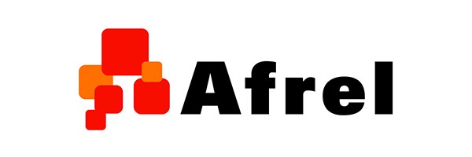
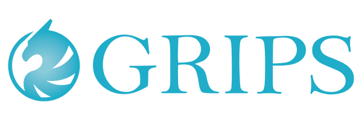
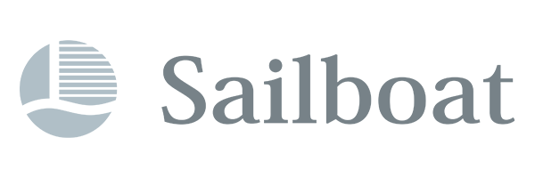
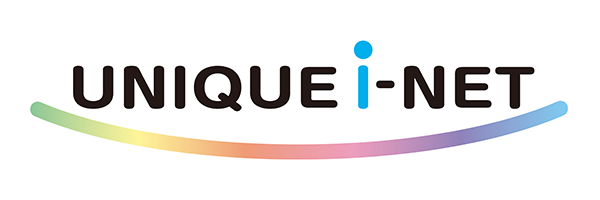
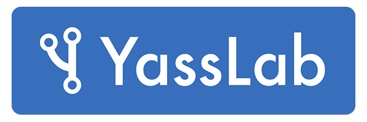

  

  <h1>
    
    
  </h1>
    <!-- 

      <h1>DojoCon Japan  {{ site.year }}</h1>
      <h2 class="text-center">見渡す</h2>
      <h3 class="text-center">December 18th / ONLINE</h3>
    
 -->
  

  

    

      

        

          <h2 class="title-text text-center">DojoCon Japan {{ site.year }}</h2>
          

            <h3 class="my-4 text-center">日本最大の CoderDojo の祭典</h3>
          

          

            
DojoCon とは CoderDojo コミュニティが全国から集まる、年に１度のカンファレンスイベント (CoderDojo Conference) です。

            
「DojoCon Japan」はこの日本版という位置づけで、2016年〜2017年は大阪、2018年は東京、2019年は名古屋で開催され、2020年は初のフルオンライン開催となりました。

	    
2021年は通算6回目となり、昨年と同じくフルオンラインで開催します。

          

          

            <h3>CoderDojo とは</h3>
            
子ども達にプログラミングを学ぶ場を提供する、ボランティア主導の世界的な非営利活動です。

            
CoderDojo は2011年にアイルランドから始まり、現在は世界112カ国に2,200以上の道場があり、日本国内でも全国234以上の道場で毎年1,200回以上 (*1) 開催されています。CoderDojo はエンジニアやデザイナー、各地域の保護者や学生、研究者や経営者など（メンター）と子どもが出会える場にもなっています。
               <small>*1 統計情報: <a href='https://coderdojo.jp/stats' target="_blank">https://coderdojo.jp/stats</a></small>

          

          

            <h3>DojoCon Japan {{ site.year}} について</h3>
            
2021年はCoderDojoが10周年を迎え、DojoCon Japanも昨年の開催で通算5回目を数えました。とてもめでたいので皆で集まってお祝いしましょう。

	    
長くCoderDojoを続けている方も、今年始めたばかりの方も、ちょっと休止中の方も、新しい道に進んだ方も、メンター・Ninjaにかかわらず、これまで各地で行ってきた取り組みを振り返り、オンラインでここに持ち寄ってください。

	    
ここまでの長い道のりをCoderDojo10周年とともに振り返りながら、次の10年を一緒に見渡してみませんか。

          

        

      

    

  

  

    

      

        <h2 class="text-center title-text">ABOUT</h2>
        
開催概要

      

      

        
開催日

        
{{ site.date_event }}

      

      

        
場所

        
{{ site.venue }}

      

      

        
参加費

        
{{ site.price }}

      

      

        
内容

        
全国の CoderDojo 関係者によるセッション、イベント企画、懇親会など。

        <ul class="text-left list-style-none">
          <li><a href="/sessions"><i class="fas fa-link"></i> セッション情報を見る</a></li>
	  <li><a href="/events"  ><i class="fas fa-link"></i> イベント企画を見る</a></li>
          <li><a href="/#news"   ><i class="fas fa-link"></i> お知らせ情報を見る</a></li>
          <!--<li><a href="/workshops"><i class="fas fa-link"></i> ワークショップの詳細を見る</a></li>-->
        </ul>
      

    

    
     
    

      

        

          <a href="https://dojocon-japan.doorkeeper.jp/events/129895"  class="button" target="_blank" rel="noopener">参加申込をする （無料）</a>
        

      

      

       
      <h2>タイムテーブル</h2>
      
      <ul class="text-center list-style-none">
        <li><a href="/sessions"><i class="fas fa-link"></i> セッション情報を見る</a> / <a href="/events"  ><i class="fas fa-link"></i> イベント企画を見る</a></li>
      </ul>
    

    

      

        

          <h2 class="text-center title-text">ライブ配信を見る</h2>
	   
	  <a href="https://www.youtube.com/watch?v=YzSutW3ibrE"  class="button" target="_blank" rel="noopener"><i class="fab fa-youtube"></i> 午前の部 (YouTube)</a>
	   
	  <a href="https://www.youtube.com/watch?v=u81WfIKxTpw"  class="button" target="_blank" rel="noopener"><i class="fab fa-youtube"></i> 午後の部 (YouTube)</a>
          <!--<h4 class="text-center title-text mt-0">当日のアーカイブはこちら！</h4>-->
          <!--<a href="https://www.youtube.com/playlist?list=PL_XgRvFvKBPZOwlkFq89AzWYsyp8tMD4s"  class="button" target="_blank" rel="noopener">Youtubeプレイリストを開く</a>-->
        

      

    

    <!-- NOTE: 開催後の公開する
    

      

        

          <h2 class="text-center title-text">今年のDojoCon Japan は終了しました！！</h2>
          <h4 class="text-center title-text mt-0">当日のアーカイブはこちら！</h4>
          <a href="https://www.youtube.com/playlist?list=PL_XgRvFvKBPZOwlkFq89AzWYsyp8tMD4s"  class="button" target="_blank" rel="noopener">Youtubeプレイリストを開く</a>
        

      

    

    -->
  

  

    <section id="news" class="section-gray">
      

        <h2 class="text-center title-text">NEWS</h2>
        
お知らせ

        

          
            
          
        

      

    </section>
  

  

  

    

      

        <h2 class="text-center title-text">Countdown DojoCon Japan</h2>
        
DojoCon Japan 2021 の内容を紹介するライブ配信です。

      

      

	
        
各セッションの見どころ <a href='https://www.youtube.com/watch?v=2VIMymUsfiE'><i class="fab fa-youtube"></i> 視聴する</a>

      

      

	
        
イベント企画の紹介 <a href='https://www.youtube.com/watch?v=eyxSGb6zs54'><i class="fab fa-youtube"></i> 視聴する</a>

      

      

	
        
これまでの DojoCon Japan <a href='https://www.youtube.com/watch?v=oPn8IWpBK3U'><i class="fab fa-youtube"></i> 視聴する</a>

      

      

	
        
2021年のテーマについて <a href='https://www.youtube.com/watch?v=zWIzR6_vnP0'><i class="fab fa-youtube"></i> 視聴する</a>

      

    

  

<section id="contact" class="bg-main">
  

    <h2 class="text-center title-text">CONTACT</h2>
    
気になる点などあればお気軽にご連絡ください。

    <!--
{{ site.email }}
-->
    <a href="https://dojocon-japan.doorkeeper.jp/contact/new" class="button" target="_blank" rel="noopener">お問い合わせする</a>
  

</section>

<!--

  

    

      <h2>SPONSORED</h2>
    

  

  

    

      <h3 class="title-sponsor">GOLD SPONSOR</h3>
    

  

  

    

      

        
      

    

  

  

    

      <h3 class="title-sponsor">SILVER SPONSOR</h3>
    

  

  

    

        
    

  

  

    

      <h3 class="title-sponsor">BRONZE SPONSOR</h3>
    

  

  
  
    

      
    

    

      
    

    

      
    

    

      
    

    

      
    

    

      
    

  

  

    

      <h3 class="title-sponsor">INKIND SPONSOR</h3>
    

  

  

    

      <a href="https://nulab.com/ja/">
        
        
backlog のご提供

      </a>
    

    

      <a href="https://yasslab.jp/ja/">
        
        
Doorkeeper スポンサーシップのご提供

      </a>
    

  

-->

<!--

  

    <h3 class="title-sponsor">ワークショップ協力</h3>
  

  

    

      
      
<a href="https://corporate.pokemon.co.jp/">株式会社ポケモン</a>

    

  

-->

<section id="organizedBy" class="section-gray">
  

    <h2 class="text-center title-text">Organized by</h2>
    <!--
主催
-->
    
DojoCon Japan {{ site.year }} 実行委員会

    
<a href="https://coderdojo.jp/" target="_blank" rel="noopener">一般社団法人 CoderDojo Japan</a>

    <!--
    
後援

    
<a href="https://coderdojo.com/" target="_blank" rel="noopener">CoderDojo Foundation</a>

    -->
  

</section>
